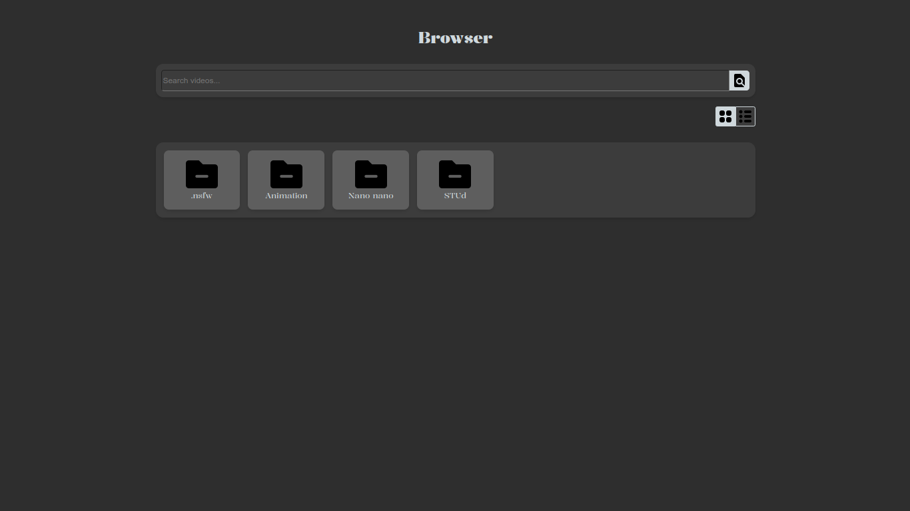
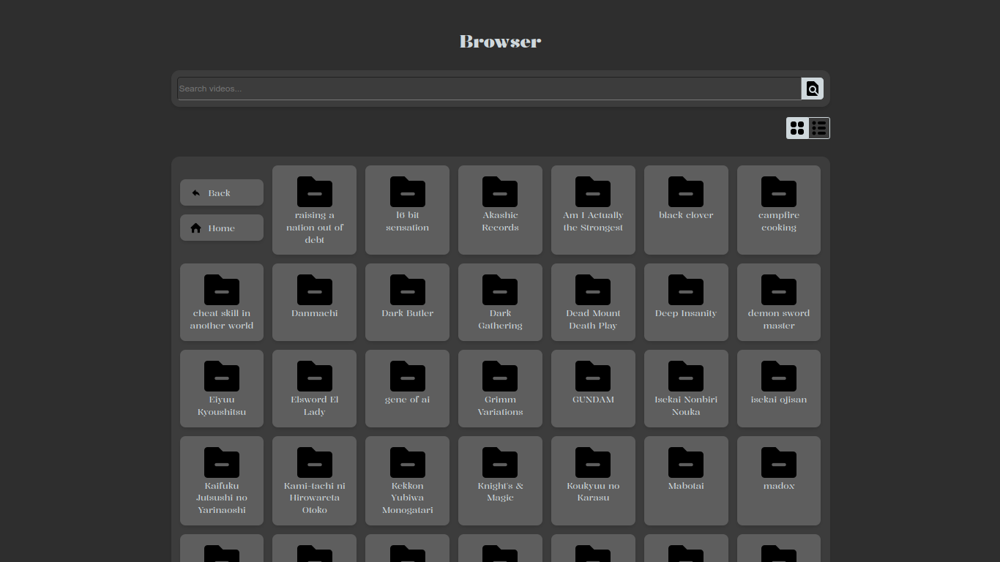
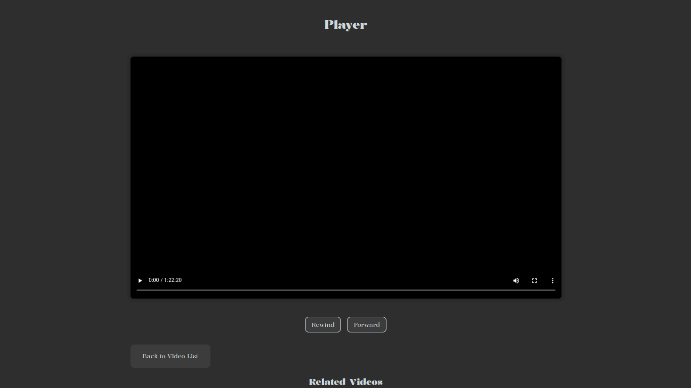
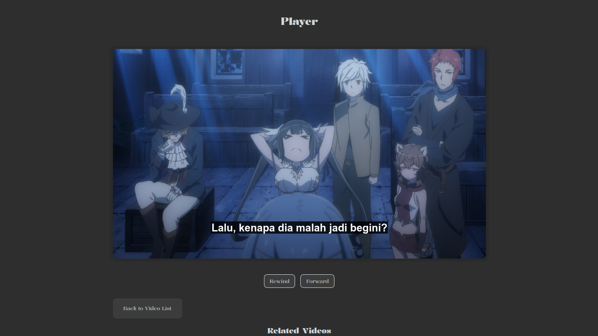

# Video Browser

**Video Browser** is a powerful, web-based video management application that provides a seamless way to browse, play, and manage videos stored on a local server. Built with Python's Flask framework, this application integrates features such as dynamic thumbnail generation, subtitle extraction, directory browsing, and video streaming, all through an intuitive web interface.

## Table of Contents

- [Overview](#overview)
- [Features](#features)
- [Prerequisites](#prerequisites)
- [Installation](#installation)
- [Configuration](#configuration)
- [Usage](#usage)
  - [Running the Server](#running-the-server)
  - [API Endpoints](#api-endpoints)
- [Directory Structure](#directory-structure)
- [Video Playback](#video-playback)
- [Thumbnail Generation](#thumbnail-generation)
- [Subtitle Extraction](#subtitle-extraction)
- [Caching Mechanism](#caching-mechanism)
- [Error Handling](#error-handling)
- [Logging](#logging)
- [Contributing](#contributing)
- [Demo](#demo)

## Overview

**Video Browser** provides a user-friendly platform for managing a local library of video files. Designed for users who want a lightweight yet feature-rich solution, it allows you to stream videos, generate and display thumbnails, extract subtitles, and navigate directories—all through a web interface that runs locally on your machine or a remote server.

## Features

- **Video Streaming**: Stream video files directly from your server to any web browser.
- **Dynamic Thumbnail Generation**: Automatically generate video thumbnails using FFmpeg.
- **Subtitle Extraction**: Extract and serve subtitles for videos using FFmpeg.
- **Directory Browsing**: Browse the server's file structure to locate and play video files.
- **Caching Mechanisms**: Enhance performance through caching of thumbnails and directory structures.
- **Customizable Settings**: Configure paths, file types, server details, and more via a simple configuration file.
- **RESTful API**: Interact programmatically with the server using well-defined API endpoints.
- **Cross-platform Compatibility**: Run the application on any operating system that supports Python.

## Prerequisites

Ensure you have the following installed:

- **Python 3.x**: [Download Python](https://www.python.org/downloads/)
- **FFmpeg**: Required for video processing tasks (thumbnail generation and subtitle extraction). Install FFmpeg from [FFmpeg's official website](https://ffmpeg.org/download.html).

## Installation

To set up **Video Browser** on your machine:

1. **Clone the repository**:

   ```sh
   git clone https://github.com/1999AZZAR/video-browser.git
   cd video-browser
   ```

2. **Install the required dependencies**:

   Make sure you have Python 3.x installed, then install the necessary Python packages:

   ```sh
   pip install -r requirements.txt
   ```

3. **Install FFmpeg**:

   Follow the instructions for your operating system to install FFmpeg from [here](https://ffmpeg.org/download.html).

## Configuration

The application uses a configuration file (`config.ini`) to manage settings such as server details, file paths, and supported file extensions.

### Sample `config.ini`

```ini
[Server]
HOST = 0.0.0.0         ; Host IP address for the server
PORT = 5000            ; Port number for the server
BASE_URL = /           ; Base URL path for the application

[Paths]
VIDEO_DIR = /path/to/your/videos  ; Directory containing your video files
THUMBNAIL_DIR = /path/to/thumbnails ; Directory to store generated thumbnails

[Videos]
EXTENSIONS = .mp4,.mkv,.avi    ; Supported video file extensions

[Subtitles]
EXTENSIONS = .srt,.vtt         ; Supported subtitle file extensions

[Display]
SHOW_HIDDEN = False            ; Show hidden files and directories
```

- **HOST**: IP address to bind the server (e.g., `0.0.0.0` for all IPs).
- **PORT**: Port number on which the server will run.
- **VIDEO_DIR**: Directory where the video files are stored.
- **THUMBNAIL_DIR**: Directory to store and cache generated thumbnails.
- **EXTENSIONS**: Comma-separated list of supported video and subtitle file extensions.
- **SHOW_HIDDEN**: Option to show or hide hidden files and directories in the web interface.

## Usage

### Running the Server

To run the server, navigate to the project directory and execute:

```sh
python video_browser.py
```

The server will start, and you can access the application in your web browser by navigating to `http://<your-ip-address>:<port>`.

### API Endpoints

The application provides several RESTful API endpoints for interaction:

- **GET /**: Displays the homepage with a list of available videos.
- **GET /api/structure**: Returns the directory structure of the video directory in JSON format.
- **GET /play/<filename>**: Plays the selected video file.
- **GET /video/<filename>**: Streams the requested video file.
- **GET /thumbnail/<filename>**: Returns the thumbnail image for the video.
- **GET /api/related-videos**: Provides a list of related videos in the same directory.

## Directory Structure

The application recursively scans the configured `VIDEO_DIR` and presents a structured view of folders and supported video files. The browsing experience is configurable via the `SHOW_HIDDEN` parameter in the configuration file, which determines whether hidden files and directories are displayed.

## Video Playback

The **Video Browser** uses the HTML5 `<video>` element for seamless playback of supported video formats. The server streams the video file directly, allowing playback to start without downloading the entire file.

## Thumbnail Generation

Thumbnails are generated using FFmpeg by extracting a frame from the middle of the video file. If a thumbnail does not exist, it will be created the first time a video is accessed. Thumbnails are stored in the configured `THUMBNAIL_DIR`.

### Caching Mechanism

To improve performance, the application employs caching mechanisms:

- **Thumbnails**: Once generated, thumbnails are cached in the `THUMBNAIL_DIR`.
- **Directory Structure**: The directory structure of the `VIDEO_DIR` is cached to minimize the need for repeated filesystem scans.

## Subtitle Extraction

Subtitles are extracted using FFmpeg and served alongside the video files when available. The server checks for external subtitle files with supported extensions (`.srt`, `.vtt`) and extracts embedded subtitles from videos.

## Caching Mechanism

The **Video Browser** uses a caching mechanism to enhance performance:

- **Thumbnails**: Once generated, thumbnails are cached in the `THUMBNAIL_DIR` to reduce processing time for future requests.
- **Directory Structures**: The application caches directory structures to speed up browsing, reducing the need for repeated directory scans.

## Error Handling

The application is designed to handle various errors gracefully:

- **404 Not Found**: Returned when a requested video or thumbnail does not exist.
- **500 Internal Server Error**: Triggered by server-side issues like misconfigurations or file access errors.
- **FFmpeg Errors**: FFmpeg-related errors (e.g., missing files, unsupported formats) are logged, and appropriate HTTP status codes are returned to the client.

## Logging

All activities, including server requests, errors, and debug information, are logged to a file for monitoring and troubleshooting purposes. The logging behavior and level (e.g., `INFO`, `DEBUG`, `ERROR`) can be adjusted within the `_configure_logging` method in the `video_browser.py` script.

## Contributing

Contributions are welcome! To contribute:

1. Fork the repository.
2. Create a new branch for your feature or bugfix.
3. Commit your changes with clear messages.
4. Submit a pull request to the main repository.

Please ensure your code adheres to the project's coding standards and includes relevant documentation and tests.

## Demo





